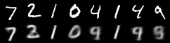

# VAE: Variational Autoencoder
VAE implementation in PyTorch. 

## Results
### results_train (generated by `train.py`)
Learned 2D latent space, randomly generated images, and reconstructed images. 
| Epoch 0 | Epoch 10 | Epoch 30 | Animation |
| :---: | :---: | :---: | :---: |
|  |  |  |  |
|  |  |  |  |
|  |  |  |  |

### results_infer (generated by `infer.py`)
Generated images from learned 2D latent space. 
| Move along z1 | Move along z2 | Move from (-2, 2) to (2, -2) |
| :---: | :---: | :---: |
|  |   |   | 

## Structure
* `train.py` - Main file to train a VAE, and save the trained model. 
* `infer.py` - Main file to load the pre-trained VAE and generate images by sampling variables in the learned latent space. 
* `models.py` - Utility. Model implementations. 
* `train_utils.py` - Utility. Functions to train models. 
* `tutorial.py` - Raw copy of the tutorial found [here](https://github.com/pytorch/examples/tree/main/vae). 

